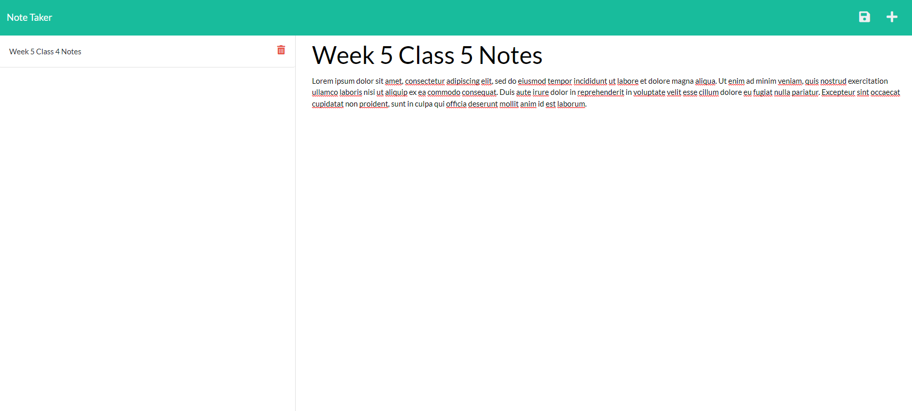

## note-input-taker

## Description
This is an app where a user can take notes and save them to a database.  In addition, the user is able to delete notes they do not need or want.

As a young software developer, taking notes on difficult programming languages/syntax has been essential for my learning.  Hopefully this app can help other students, employees, and anyone who just needs a place to write notes down.

The most challenging part of this assignment was making sure the routes worked correctly.  The order was important, as well as proper path references.  Other than that, it was such a great feeling seeing notes get added and deleted when it all came together.

## Contributors
I wrote the back end code, but also received help from my instructor John, TA Michael, classmate Sam, and utilized the help of a couple BCS tutors.

## Testing
To use this application, click on the dark gray "Get Started" button on the home page.  Then, click on the empty note to add a note title and note text.  Click the save icon in the upper right corner to save the note.  Finally, if you would like to delete the note, click on the red trash can icon.  There is also a screenshot below of what the notes page should look like when running properly.

## License
Matt Carlson Code, 2022